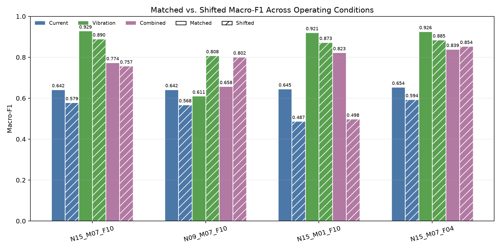
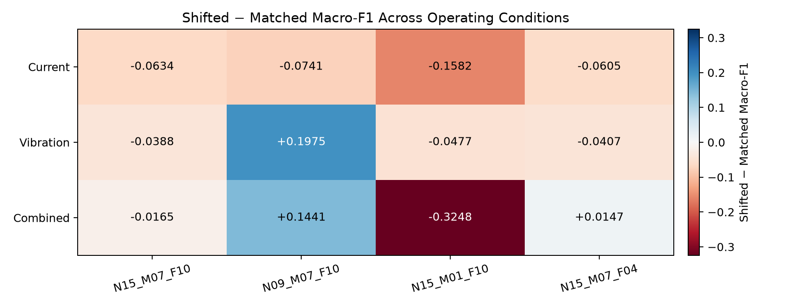
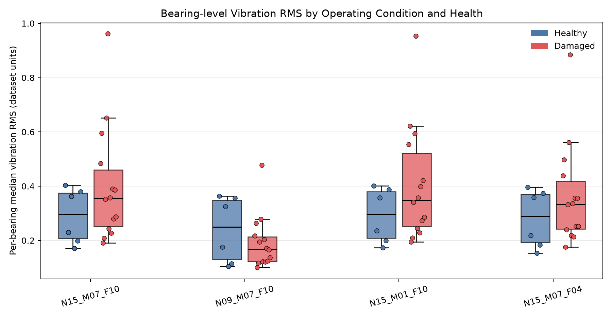

# Operating-state-aware monitoring

This repository contains an independent research project on measurement value
under changing equipment states. The first case uses the UCI hydraulic-systems
dataset to study one concrete question:

> How do different measurements support pump-leakage classification, and what
> observable signal changes can be connected to a physically reasonable
> interpretation?

The Hydraulic case is complete as a reproducible, descriptive study. It does
not claim a universally optimal sensor set, a causal leakage mechanism, a
production-ready monitor, or energy savings.

## Hydraulic case

The source dataset contains 2,205 repeated 60-second operating cycles and
cycle-level values for cooler condition, valve condition, pump leakage,
accumulator pressure, and a stable flag. The primary analysis keeps the 1,449
cycles with `stable_flag == 0`:

| Target label | Count |
|---:|---:|
| `pump_leakage = 0` | 489 |
| `pump_leakage = 1` | 480 |
| `pump_leakage = 2` | 480 |

The eligible rows form 144 contiguous condition blocks. A new block starts when
the condition labels change or the original cycle index is no longer
consecutive. There are 143 blocks of 10 cycles and one block of 19 cycles.
These are observed groups for split control, not verified independent
experimental runs.

The primary hydraulic family uses measured pressure and flow channels:
`PS1–PS6` and `FS1–FS2`. The comparison adds measured motor power (`EPS1`),
temperature (`TS1–TS4`), and vibration (`VS1`) as separate families. Virtual
channels `CE` and `CP`, and unresolved channel `SE`, are excluded from the
primary model inputs.

## Evaluation protocol

- Features: per-channel mean, standard deviation, minimum, and maximum.
- Split: five-fold `StratifiedGroupKFold`, with the same group excluded from
  both training and test portions of a fold.
- Preprocessing: `StandardScaler` fit inside each training fold.
- Model: logistic regression with the fixed Task04 settings; no
  family-specific or combination-specific tuning.
- Primary metric: pooled out-of-fold macro-F1.
- Secondary metrics: balanced accuracy, per-class recall, and confusion
  matrix.
- Stability check: the same comparison repeated with seeds `42/43/44/45/46`.

## Reproduce the experiments

Run these commands from the repository root with the `windfusion` Conda
environment:

| Experiment | Command |
|---|---|
| First baseline | `conda run --no-capture-output -n windfusion python src/run_first_baseline.py` |
| Measurement-family comparison | `conda run --no-capture-output -n windfusion python src/run_family_comparison.py` |
| Incremental measurement value | `conda run --no-capture-output -n windfusion python src/run_incremental_value.py` |
| Split stability and condition check | `conda run --no-capture-output -n windfusion python src/run_stability_check.py` |
| Physical interpretation | `conda run --no-capture-output -n windfusion python src/run_physical_interpretation.py` |

The verified environment was `windfusion` with Python 3.11.16, NumPy 2.4.6,
pandas 3.0.5, Matplotlib 3.11.2, and scikit-learn 1.9.1. The raw dataset and
generated outputs stay local; the commands regenerate the ignored files under
`outputs/`. The five commands were rerun for this delivery, and each exited
with code `0`.

## Results

### Baseline

The hydraulic pressure-and-flow baseline reaches pooled OOF macro-F1 `0.9723`
and balanced accuracy `0.9723`. The dummy reference reaches pooled OOF
macro-F1 `0.3091`.

### Measurement families

All families use the same eligible cycles, grouped folds, model, and four
summary statistics per channel.

| Family | Feature shape | Macro-F1 | Balanced accuracy |
|---|---:|---:|---:|
| Hydraulic | `1,449 × 32` | 0.9723 | 0.9723 |
| Motor power | `1,449 × 4` | 0.6852 | 0.7008 |
| Temperature | `1,449 × 16` | 0.5107 | 0.5146 |
| Vibration | `1,449 × 4` | 0.4294 | 0.4320 |

Under this representation and protocol, the hydraulic family provides the
clearest separation of the target. The table does not rank sensor families in
general; it reports one fixed comparison on this dataset.

### Incremental measurement value

Hydraulic measurements remain the reference. The delta is the paired pooled
OOF macro-F1 difference from the hydraulic-only prediction.

| Combination | Macro-F1 | Δ Macro-F1 |
|---|---:|---:|
| Hydraulic | 0.9723 | 0.0000 |
| Hydraulic + motor power | 0.9855 | +0.0131 |
| Hydraulic + temperature | 0.9709 | -0.0014 |
| Hydraulic + vibration | 0.9765 | +0.0042 |
| All measurements | 0.9862 | +0.0138 |

The positive motor-power addition is larger than the vibration addition in this
run. Temperature does not improve the hydraulic reference under the fixed
feature and model choices. These are incremental predictive differences, not
sensor ROI, causal effects, or proof of independent information.

### Split stability and condition strata

Across five grouped split seeds, the pooled OOF results are:

| Combination | Macro-F1 mean ± SD | Macro-F1 range | Δ Macro-F1 vs hydraulic |
|---|---:|---:|---:|
| Hydraulic | 0.9716 ± 0.0034 | 0.9675–0.9772 | 0.0000 ± 0.0000 |
| Hydraulic + motor power | 0.9845 ± 0.0013 | 0.9827–0.9862 | +0.0129 ± 0.0023 |
| Hydraulic + temperature | 0.9711 ± 0.0036 | 0.9682–0.9779 | -0.0006 ± 0.0023 |
| Hydraulic + vibration | 0.9762 ± 0.0029 | 0.9723–0.9813 | +0.0045 ± 0.0013 |
| All measurements | 0.9848 ± 0.0015 | 0.9820–0.9862 | +0.0131 ± 0.0023 |

Motor power improves macro-F1 in every seed and every listed seed-42
condition stratum. The all-measurements combination is also positive in every
listed stratum. Temperature changes sign across seeds and remains close to the
hydraulic reference. Vibration remains positive, but the gain is smaller.

These condition results are descriptive support checks. The condition blocks
are not independent-run identifiers, so they do not provide independent-run
confidence intervals.

### Physical interpretation

The physical interpretation uses measured motor power, pressure, flow, and
temperature signals rather than virtual channels or an assumed hydraulic
topology. The main observations are:

- `EPS1` motor-power median: `2465.218 → 2547.456 → 2557.540 W`.
- `PS3` pressure median: `1.799 → 1.757 → 1.731 bar`, with the same downward
  direction visible in several later phases.
- `FS1` flow median: `6.660 → 6.458 → 6.361 l/min`; this is a small shift and
  not a standout raw-trace pattern.
- `FS2` is nearly unchanged, while other pressure channels respond in mixed
  directions and temperature medians overlap.

These patterns are compatible with an internal-leakage signature hypothesis:
some effective output flow may decrease, motor operating demand may change,
and different circuit locations may show different pressure responses. The
interpretation remains a hypothesis because the retained source information
does not verify sensor topology, load control, or upstream/downstream pressure
pairs. No `Δp × Q` power proxy is calculated.

The detailed physical explanation, including the Chinese working
interpretation, is in [physical interpretation](docs/hydraulic/physical-interpretation.md).

## 理解過程

Hydraulic dataset 有 `pump_leakage = 0 / 1 / 2` 三種狀態，可以先把它當成固定 target，觀察不同 sensor 對這三種狀態的辨識能力。主要使用 `stable_flag == 0` 的 1,449 個 cycles。

Pressure + flow 本身就有很強的辨識能力，macro-F1 約 `0.9723`。

單獨看不同 sensor family：

```text
Hydraulic      0.9723
Motor power    0.6852
Temperature    0.5107
Vibration      0.4294
```

代表 pressure + flow 對這個 target 的資訊最明顯。

接著看「已有 pressure + flow 的情況下，再加入其他 sensor 有沒有幫助」：

```text
Hydraulic                  0.9723
+ Motor power              0.9855
+ Temperature              0.9709
+ Vibration                0.9765
All                        0.9862
```

Motor power 的增益最大，vibration 有小幅增益，temperature 幾乎沒有增加。

不同 split 下，motor power 的增益仍然存在，所以這個增益不是只出現在某一次資料切分。最後直接看 sensor signal：

```text
EPS1 motor power ↑
PS3 pressure     ↓
FS1 flow         ↓
FS2              幾乎不變
Temperature      差異不明顯
```

## 決策過程

研究順序可以理解成：

```text
先看 pressure + flow 能不能辨識 leakage
↓
比較不同 sensor family
↓
看新 sensor 加進去後有沒有額外價值
↓
用不同 split 檢查結果是否穩定
↓
直接看原始 signal 的變化
↓
把模型結果和實際量測變化連起來
```

重點不是找「分數最高的 sensor」，而是分兩件事看：

```text
這個 sensor 本身有多少資訊？

已有其他 sensor 時，
它還能不能提供新的資訊？
```

## 結論

Pressure + flow 已經可以很好地區分 pump leakage。

Motor power 單獨表現沒有 pressure + flow 好，但加入 pressure + flow 後還能提升結果，所以有明顯的額外資訊。

Vibration 有一些額外資訊，但幅度比較小。

Temperature 在目前做法下沒有帶來明顯增益。

Signal 本身也有對應變化，尤其是：

```text
EPS1 上升
PS3 下降
FS1 下降
```

因此這個專案可以簡單理解成：

> 比較不同 sensor 在設備狀態變化時提供多少資訊，再看多個 sensor 放在一起後，哪些量測還能增加監測價值。

## Reading order

1. [Measurement audit](docs/hydraulic/measurement-audit.md)
2. [Target feasibility](docs/hydraulic/target-feasibility.md)
3. [Single-cycle read](docs/hydraulic/single-cycle-read.md)
4. [First baseline](docs/hydraulic/first-baseline.md)
5. [Measurement-family comparison](docs/hydraulic/family-comparison.md)
6. [Incremental measurement value](docs/hydraulic/incremental-value.md)
7. [Stability and condition stratification](docs/hydraulic/stability-confounding.md)
8. [Physical interpretation](docs/hydraulic/physical-interpretation.md)

## Source and license

The data source is the UCI Machine Learning Repository dataset [Condition
monitoring of hydraulic systems](https://archive.ics.uci.edu/dataset/447/condition%2Bmonitoring%2Bof%2Bhydraulic%2Bsystems),
dataset 447.

Citation:

> Helwig, N., Pignanelli, E., & Schütze, A. (2015). *Condition monitoring of
> hydraulic systems* [Dataset]. UCI Machine Learning Repository.
> https://doi.org/10.24432/C5CW21

The UCI record states that the dataset is available under the [Creative
Commons Attribution 4.0 International license (CC BY
4.0)](https://creativecommons.org/licenses/by/4.0/). See the [Hydraulic
dataset reference](references/hydraulic/README.md) for the retained source and
license record. The dataset license does not assign a license to the project
source code.

## Paderborn case

The Paderborn case studies whether current and vibration measurements can separate healthy and damaged bearings when the operating condition changes. One recording is one sample. The first protocol uses 6 healthy bearings and 14 accelerated-lifetime damaged bearings, with bearing-level folds and four fixed operating conditions.

The local data layout, source links, and signal notes are in [Paderborn dataset notes](data/paderborn/README.md). The reproducibility steps are in [Paderborn reproducibility](docs/paderborn/reproducibility.md).

### Main results

Under the matched `N15_M07_F10` condition, vibration gives the strongest result:

| Sensor group | Macro-F1 |
|---|---:|
| Current | 0.6421 |
| Vibration | 0.9289 |
| Current + vibration | 0.7740 |

Adding current to vibration does not improve this matched result. Under the
fixed features and logistic-regression model, the combined score is lower than
the vibration-only score.

The four-condition comparison is less uniform. Current declines under every
condition shift, with macro-F1 changes from `-0.0605` to `-0.1582`. Vibration
declines in three conditions but improves by `+0.1975` for `N09_M07_F10`.
Combined features range from a `-0.3248` drop under `N15_M01_F10` to a
`+0.1441` improvement under `N09_M07_F10`. The operating condition therefore
remains part of the result; there is no single robustness ranking that holds
across all four conditions.

The bearing-level vibration RMS comparison adds signal-level context. Damaged
bearings usually have higher RMS in three conditions, but the direction
reverses under `N09_M07_F10`. The healthy and damaged distributions also
overlap, and damaged bearings differ substantially from one another. Vibration
carries useful damage information here, but it is not a fixed threshold or a
condition-free signature.

### Figures

Figure 1 compares matched and shifted macro-F1 for each sensor group. See the
[four-condition robustness notes](docs/paderborn/four-condition-robustness.md)
for the full table and protocol.



Figure 2 shows the same result as `shifted - matched`. Negative cells indicate
a decline after the training condition changes; positive cells indicate an
improvement in that test condition.



Figure 3 returns to the signal itself. Each point is one bearing, using the
median vibration RMS across its eligible recordings under that operating
condition. See the [signal feature interpretation](docs/paderborn/signal-feature-interpretation.md)
for the recording-level checks and limits of the interpretation.



Main Paderborn runs:

| Experiment | Command |
|---|---|
| Single recording check | `conda run --no-capture-output -n windfusion python src/read_paderborn_recording.py` |
| Fixed target and split | `conda run --no-capture-output -n windfusion python src/build_paderborn_protocol.py` |
| Matched sensor comparison | `conda run --no-capture-output -n windfusion python src/run_paderborn_matched_sensor_comparison.py` |
| Four-condition robustness | `conda run --no-capture-output -n windfusion python src/run_paderborn_four_condition_robustness.py` |
| Signal feature interpretation | `conda run --no-capture-output -n windfusion python src/analyze_paderborn_signal_features.py` |

The raw Paderborn recordings and generated outputs remain local and are not committed.

## What the two cases say about measurement value

The Hydraulic case starts with a strong pressure-and-flow reference and asks
whether another measurement still adds information. Motor power raises
macro-F1 from `0.9723` to `0.9855`, vibration gives a smaller increase to
`0.9765`, and temperature does not improve the reference under the fixed
features and model.

The Paderborn case asks a different part of the same question. Vibration is the
strongest single measurement in the first matched comparison, but its result
changes with the operating condition. Combining current and vibration is also
not consistently better than vibration alone.

Together, the two cases show that measurement value depends on the target, the
measurements already available, and the operating state. A measurement can be
informative on its own without adding much to an existing sensor set. It can
also work well in one operating condition and become weaker, stronger, or
different in another. The raw scores are not compared across the two datasets;
their targets and evaluation protocols are different.

## Scope limits

These cases do not establish a universally optimal sensor set, a cross-device
classifier, production deployment, remaining useful life, energy savings, or a
causal physical mechanism. The labels are compared as observed condition
values; they are not treated as a measured temporal degradation trajectory.
